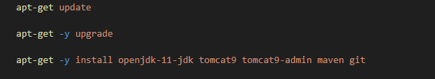
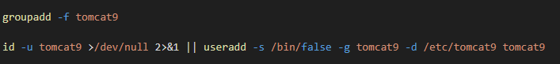
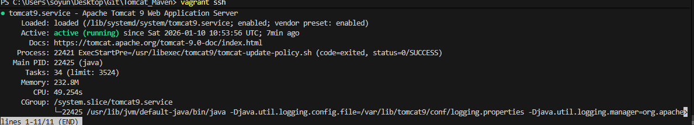
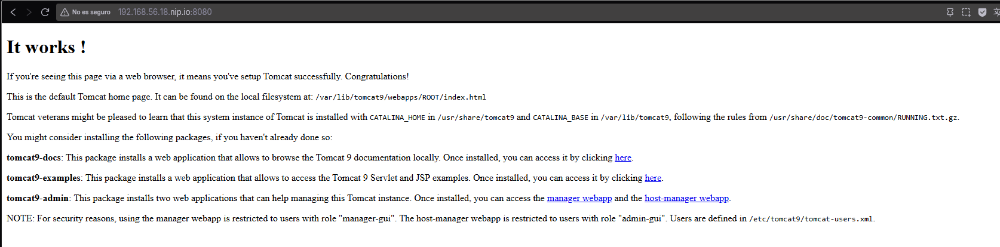

## Índice

1. [Preparación previa a la práctica](#preparacion-previa-a-la-práctica)
   - [Modificar el archivo de zona directa](#modificar-el-archivo-de-zona-directa)
   - [Modificar el Vagrantfile](#modificar-el-vagrantfile)
   - [Modificar el archivo resolv.conf](#modificar-el-archivo-resolvconf)
   - [Uso de Cliente FTP gráfico](#uso-de-cliente-ftp-gráfico)
2. [Instalación y configuración del servidor vsftpd sobre Linux](#2-instalación-y-configuración-del-servidor-vsftpd-sobre-linux)
   - [Archivo vsftpd.conf](#21-archivo-vsftpdconf)
   - [Conexiones con FileZilla Client](#22-comprobaciones-de-conexiones-con-filezilla-client)
3. [Instalación de certificado seguro SSL](#3-instalación-de-certificado-seguro-en-servidor-ftp)


1. Instalación de Tomcat y OpenJDK.

Para instalar ambos paquetes debemos incluir en nuestro archivo de provisión las siguientes lineas :



Previamente a su instalación usamos apt-get update y upgrade para que se actualicen e instalen los paquetes del Sistema Operativo.

1.1 Creación de Usuario y Grupo.

Para crear a un usuario y asignarle un grupo deberemos ejecutar las siguientes lineas en el archivo de provisión



En la primera linea forzamos con -f a crear un grupo llamado tomcat 9.

En la segunda linea, utilizaremos una tubería/pipe || como operador condicional :

    -En la parte de la izquierda, utilizamos el comando de Linux id para mostrar al usuario con su id, desviando la salida por pantalla y los errores a /dev/null.

    Si no se ha encontrado al usuario, se ejecutan las instrucciones de la derecha, que corresponden a la creación del usuario tomcat9, asignándole un grupo (-g) , una terminal (-s) y un directorio de trabajo ( -d ) por defecto

2. Tomcat9, Configuración y Admin-Area

Una vez realizado todo esto, realizaremos un vagrant up para comprobar el estado del servicio tomcat9, y así asegurarnos de que todo va bien :



Para desplegarlo utilizamos nip.io para saltarnos el proceso de crear un servidor dns auxiliar, se adjunta captura de la web:



2.1 Configuración del acceso remoto

Para poder solucionar errores de acceso remoto a nuestro servidor tomcat9, proporcionarios un archivo llamado context.xml al servidor para sustituir al que se carga por defecto, para ello utilizaremos la siguiente linea en el archivo de provisión :

``` bash
cp /vagrant/config_files/context.xml /usr/share/tomcat9-admin/host-manager/META-INF/context.xml
```


