## Índice

1. [Preparación previa a la práctica](#preparacion-previa-a-la-práctica)
   - [Modificar el archivo de zona directa](#modificar-el-archivo-de-zona-directa)
   - [Modificar el Vagrantfile](#modificar-el-vagrantfile)
   - [Modificar el archivo resolv.conf](#modificar-el-archivo-resolvconf)
   - [Uso de Cliente FTP gráfico](#uso-de-cliente-ftp-gráfico)
2. [Instalación y configuración del servidor vsftpd sobre Linux](#2-instalación-y-configuración-del-servidor-vsftpd-sobre-linux)
   - [Archivo vsftpd.conf](#21-archivo-vsftpdconf)
   - [Conexiones con FileZilla Client](#22-comprobaciones-de-conexiones-con-filezilla-client)
3. [Instalación de certificado seguro SSL](#3-instalación-de-certificado-seguro-en-servidor-ftp)


## 1. Instalación de Tomcat y OpenJDK.

Para instalar ambos paquetes debemos incluir en nuestro archivo de provisión las siguientes lineas :


Previamente a su instalación usamos apt-get update y upgrade para que se actualicen e instalen los paquetes del Sistema Operativo.

### 1.1 Creación de Usuario y Grupo.

Para crear a un usuario y asignarle un grupo deberemos ejecutar las siguientes lineas en el archivo de provisión


En la primera linea forzamos con -f a crear un grupo llamado tomcat 9.

En la segunda linea, utilizaremos una tubería/pipe || como operador condicional :

+ En la parte de la izquierda, utilizamos el comando de Linux id para mostrar al  usuario con su id, desviando la salida por pantalla y los errores a /dev/null.

+ Si no se ha encontrado al usuario, se ejecutan las instrucciones de la derecha, que corresponden a la creación del usuario tomcat9, asignándole un grupo (-g) , una terminal (-s) y un directorio de trabajo ( -d ) por defecto

## 2. Tomcat9 y su configuración

Una vez realizado todo esto, realizaremos un vagrant up para comprobar el estado del servicio tomcat9, y así asegurarnos de que todo va bien :


Para desplegarlo utilizamos nip.io para saltarnos el proceso de crear un servidor dns auxiliar, se adjunta captura de la web:


### 2.1 Configuración del acceso remoto

Para poder solucionar errores de acceso remoto a nuestro servidor tomcat9, proporcionarios un archivo llamado context.xml al servidor para sustituir al que se carga por defecto, para ello utilizaremos la siguiente linea en el archivo de provisión :

``` bash
cp /vagrant/config_files/context.xml /usr/share/tomcat9-admin/host-manager/META-INF/context.xml
```

Este es el fichero en cuestión :

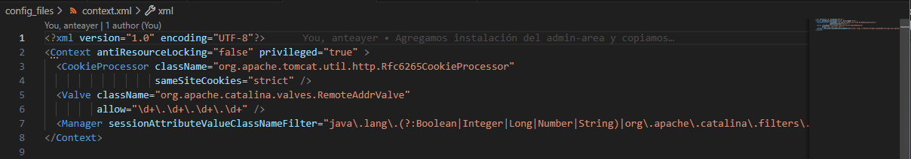

### 2.2 Usuarios en Tomcat9

Para definir los usuarios que tengan acceso a tomcat9 utilizaremos la sobre-escritura del fichero tomcat-users.xml,proporcionado por la práctica :

``` bash
cp /vagrant/config_files/tomcat-users.xml /etc/tomcat9/tomcat-users.xml

```

Este es el fichero en cuestión :

[Fichero tomcat-users XML](6.tomcat-usersXML.png)

En él creamos 2 usuarios nuevos, alumno para tomcat y alvaro para Maven, que lo usaremos más adelante

## 3. Admin-Area de Tomcat9

Para instalar dicho paquete,que proporciona herramientas de gestión y administración de servidores, agregaremos al final de la linea **apt-get install -y** el paquete correspondiente ( tomcat9-admin ) :

``` bash
apt-get -y install openjdk-11-jdk tomcat9 tomcat9-admin

```

### 3.1 Paneles de Administración Gráficos

Una vez instalado dicho paquete accederemos a las siguientes paneles de administración:

Previo a ello, nos aparecerá este inicio de sesión

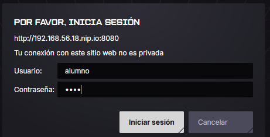

Luego, accedemos al panel del **Gestor de aplicaciones Web** :

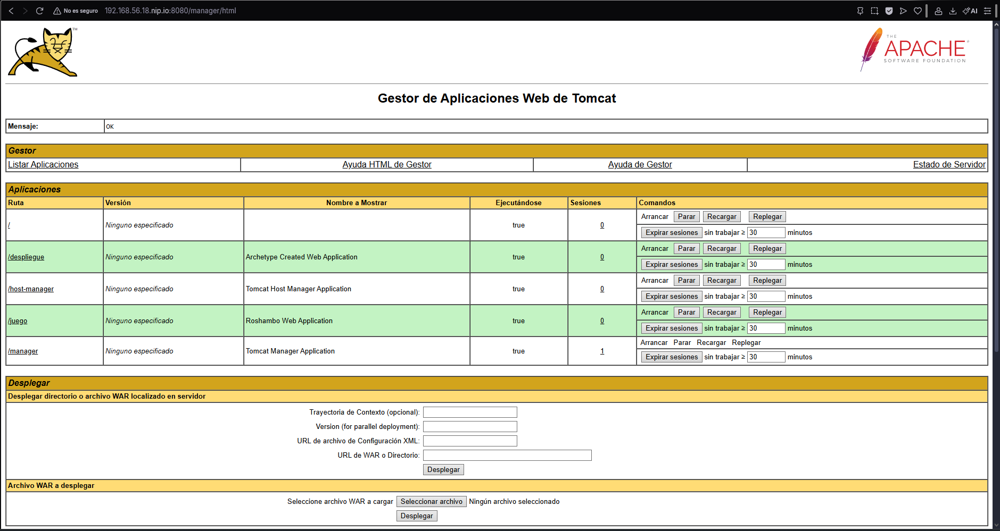

Posteriormente, accedemos al panel del **Gestor de Máquinas Virtuales** :

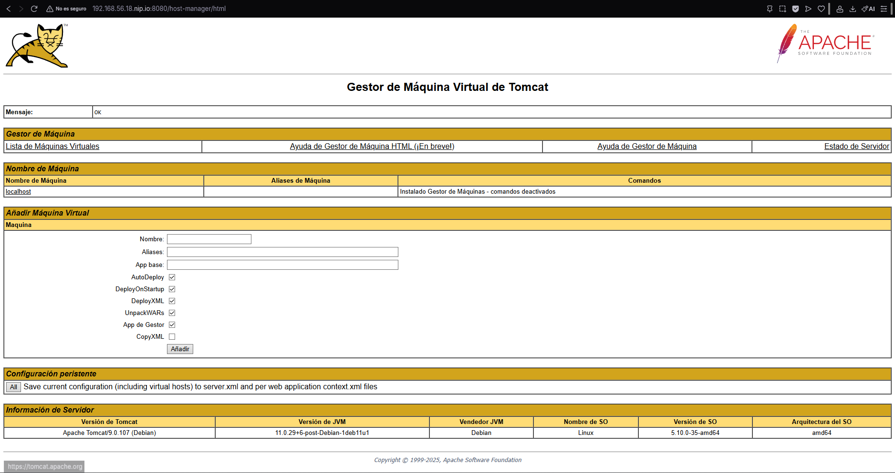

### 3.2 Despliegue Manual mediante GUI

Accedemos al Gestor de aplicaciones web y buscamos la sección **War File to Deploy** :

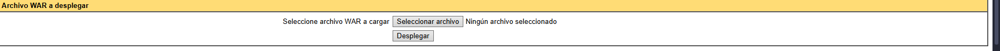

Seleccionamos el archivo de pruebas y le damos a Desplegar,luego nos aparecerá en la lista de aplicaciones :

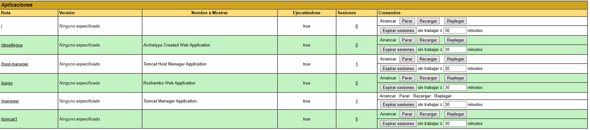

## 4. Despliegue mediante Maven

Para realizar un despliegue mediante Maven, primero tendremos que instalarlo, agregando el paquete maven a nuestra linea
llamada apt-get install -y ...

``` bash
apt-get -y install openjdk-11-jdk tomcat9 tomcat9-admin maven

```

Luego comprobaremos que todo ha ido bien con el comando **mvn -v**:

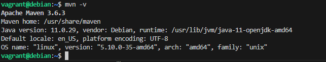

Como comentamos previamente, el usuario con acceso a Maven lo añadimos en tomcat-users.xml, siendo este **alvaro** con contraseña **1234**.

Lo siguiente será configurar Maven, con el archivo settings.xml, donde le daremos un indicador sobre que servidor se van a desplegar los proyectos.

Una vez modificado, lo añadiremos a la máquina virtual con la siguiente sentencia:

``` bash
cp /vagrant/config_files/settings.xml /etc/maven/settings.xml

```

Nota: El contenido de el archivo, previo a su sobre-escritura, lo he sacado de la Máquina Virtual haciendo primero un **cat** y luego Ctrl C , Ctrl V.

Dicho contenido es el siguiente:

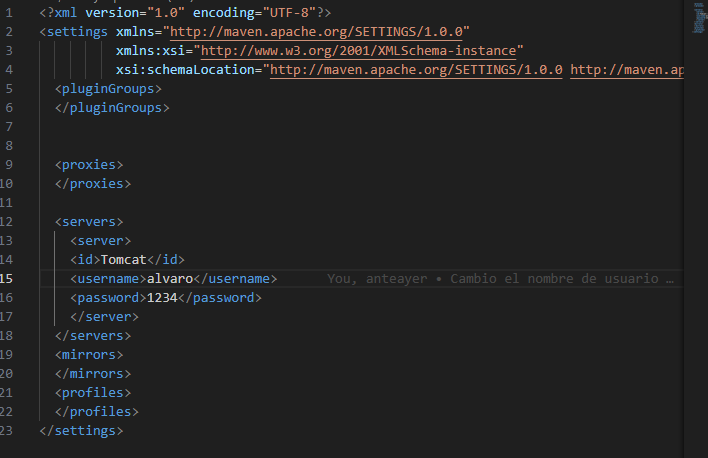

### 4.1 Generación de aplicaciones con Maven

Para generar una aplicación de prueba en Maven con el siguiente comando:

``` bash
mvn archetype:generate -DgroupId=org.zaidinvergeles \
                         -DartifactId=tomcat-pruebadespliegue \
                         -Ddeployment \
                         -DarchetypeArtifactId=maven-archetype-webapp \
                         -DinteractiveMode=false

```

Una vez generado, deberemos modificar el POM para que haga referencia al plugin que hace de intermediario entre Tomcat y Maven.

Para realizar esto modificamos el fichero pom.xml asingandole la etiqueta plugin con su contenido correspondiente:

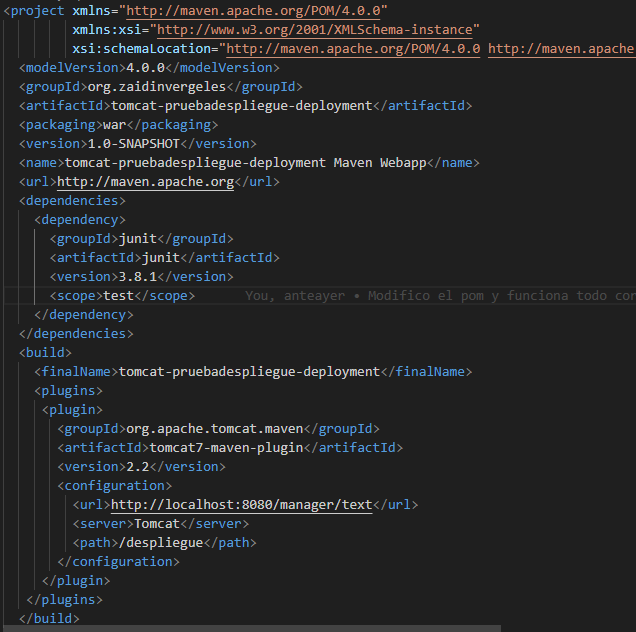

Luego sustituiremos el fichero por defecto con el siguiente comando:

``` bash
cp /vagrant/config_files/pom.xml /home/vagrant/tomcat-pruebadespliegue/pom.xml

```

### 4.2 Despliegue de la aplicación

Para desplegar la aplicación deberemos estar en su carpeta correspondiente, para posteriormente desplegarlo de manera correcta, usaremos estas 2 sentencias:

``` bash
cd /home/vagrant/tomcat-pruebadespliegue
mvn tomcat7:redeploy
```

Lo que nos dará la siguiente salida por consola :

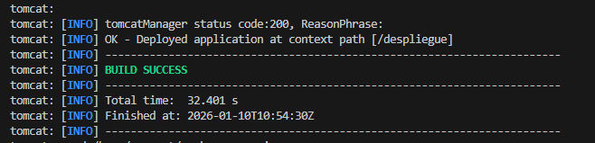

Ahora, para comprobar que todo ha funcionado, nos meteremos al enlace correspondiente para ver la aplicación desplegada:

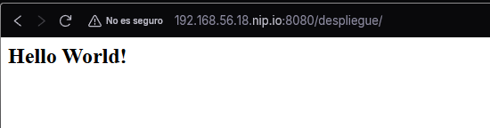


## 5. Tarea: Despliegue Rock-Paper-Scissors.

Para la siguiente tarea, realizaremos los 3 pasos inicales en nuestro fichero de provisión, las cuales serán las siguientes:

+ Instalar Git en la Máquina Virtual
+ Hacer un Git Clone del Repositorio
+ Movernos a la carpeta del repositorio descargado
+ Cambiarnos de rama

Todo ello lo realizamos con estos comandos :

``` bash
git clone https://github.com/cameronmcnz/rock-paper-scissors.git
cd rock-paper-scissors
git checkout patch-1

```


